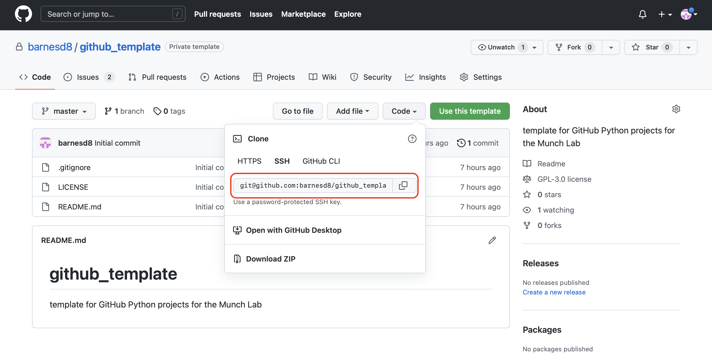

# github_template
template for GitHub Python projects for the Munch Lab

### Need to install git?
Go here: https://github.com/git-guides/install-git

### Getting Started with git

To contribute to a project, the first thing you want to do is clone the projecct.  This creates a local copy that you can work from, keep history of code changes, and ultimately merge your changes with collaborators. To do this the command you use is *git clone*.  To clone a repository, you first need to find the respository name, which can be found here:



Note you can use multiple methods to authenticate, and the url is different for each one.  Once you know the repository name, you would type the following command into your terminal:

```
git clone 'repository name'
```

If that wasn't successful, and you received an error, refer to this github help page https://docs.github.com/en/repositories/creating-and-managing-repositories/cloning-a-repository.

### Writing code in git

Before you make any changes to any files, you first need to create your own branch.  This repository has a few branches that are *protected*, or branches that you can't directly make changes on.  These branches, the *master* and *test-pypi* branches can be configured to integrate directly with pypi for package distribution, and as such, require approval and code review to merge any changes.  Each branch should correspond to a software feature or issue with the code, and be named accordingly.  For example, for the creation of this readme file, we can create a branch called *readme*, and then make changes on that branch.  To do so navigate to the main repository folder in terminal and type:

```
git branch readme
git switch readme
```

Any changes you make should now be saved in the branch named *readme*.  If you aren't sure what branch you are on you can always check:

```
git branch
```

It's important to note that when creating new branches, they make a copy of the branch you are currently on.  So if you are on *master* and create a new branch, it will be a copy of *master*.  In the section below on structuring releases in git we will review a recommended workflow.

### Committing and pushing changes in git

Once you've made progess you'd like to save on a branch, you need to *commit* your changes, which saves them to the branch and allows you to save them on the repository on the github servers for other people to access, review, and approve merges.  To see what changes are available to be committed, you can check the status:

```
git status
```

which will show something like:


Anything under *Changes not staged for commit* will save when you commit your changes.  Anything in *Untracked files* needs to be added for commit, or listed in the .gitignore file.  For now, assume this is a file or folder we do want to save in our changes, and we will discuss .gitignore later in the document.  To add the file, you use the *git add* command, and to add all files and folder that are untracked you would type:

```
git add .
```

You can then check the status again:

```
git status
```

and get the following output:


To commit your changes:

``` 
git commit -m 'status message'
```

The status message should describe the changes you made in some detail so someone reviewing your code would understand the intention of this code.  Once you've commited the changes, you can push them to the github server:

```
git push origin readme
```

The *origin readme* says to push to the github server to a branch named readme.  To configure the github server readme branch to correspond with your local readme branch to be able to just run *git push* do the following:

```
git push --set-upstream origin readme
```

Now any changes you need to push to the github server on the readme branch can be done by just running:

```
git push
```

### Structuring and merging code in git

When working on a project in git, it's a good idea to organize the features you want to include into groupings of functionality that make sense to be included together, called *releases*.  For each feature you create a branch, and then these branches are merged together on another branch for the release.  So for example, if I have three branches that are all basic features of a package that I want to include in the same release, I'll first create a release branch and merge these onto the release branch.  Here we introduce a new command that creates and switches to the new branch at the same time.

```
git switch -c version-0.1
```

And we can see we've created and switched to the new branch named *version-0.1*


We also see we already have a readme branch, so lets create some new branches.  We can do this in the terminal, but since we are going to tie them to releases, we will actually show how to create them in the github web interface.  First, I'm going to commit and push all changes to make sure it is up to date between the local branches and the remote branches.

I'll navigate to the repo here:  https://github.com/barnesd8/github_template and go to the issues area.


I'll then drill into the highlighted one here:


And then click *Create a branch*:


You can also change which branch you are copying from by choosing *change branch source*:


I am going to choose to create the branch from the *version-0.1* branch:


This is then displayed to copy and paste and get the version locally to start working on the issue:

And then this is shown when it is run in the terminal:

You've now created a new branch to work on your issue!

### Merging code

There are a few ways to merge code, and I'll recommend using github.com to request merges, request code reviews, merge code, and resolve merge conflicts.